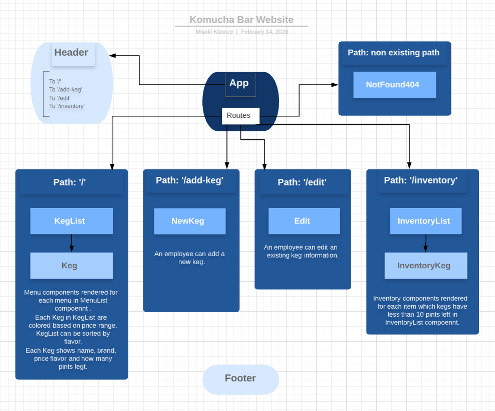

# Kombucha Bar

#### _React: Website for Kombucha Bar, Last Update 02/14/2020_

## Description
Create a website for Kombucha bar.

## Kombucha Bar Component and Route Structure


Designed using [Lucidchart](https://www.lucidchart.com/)


## Application has
### As Employee
    - An employee can add a new keg to the list.
    - An employee can edit an added keg.
    - An employee can see how many pints are left in a keg.
    - An employee can update an number of pints when a pint of the keg is sold.
    - An employee can see the list of kegs with less than 10 pints left.
    

### As Patron
    - A patron can see list of kegs includes `name`, `brand`, price` and `flavor`.
    - A patron can see color-coded kegs based on the price range.
    - A patron can see the listKe by flavor.
    - A patron can see how many pints are left in a keg.

## Installation:
1. Clone this repo:
```
$ git clone this-repo-url
```

2. Install npm:

```
$ npm install
```

3. Run the project:
```
$ npm run start 
```

4. Open up localhost:8080


## Known Bugs
- No known bugs at this time

## Support and contact details
Misaki Koonce: misaki.koonce@gmail.com

## Technologies Used
Git, GitHub, Lucidchart, ReactJS and Webpack

## License
Copyright © 2020 under the MIT License